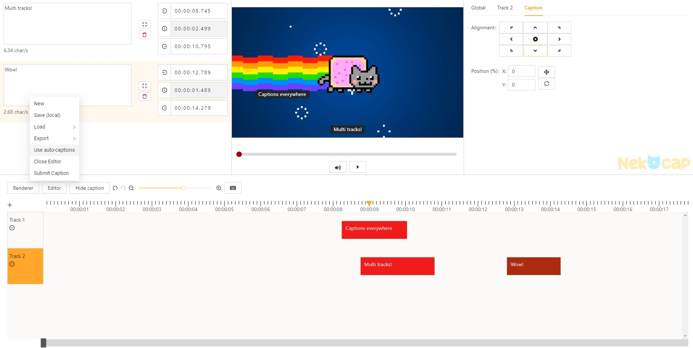
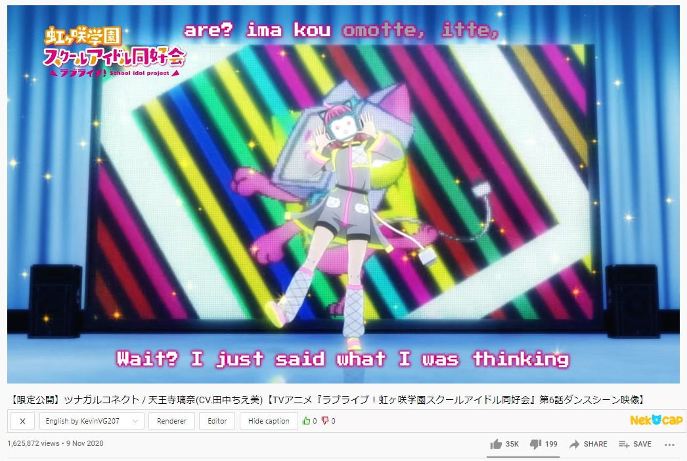

    

Logo by <a href="https://twitter.com/Iceikory" target="_blank" rel="noopener">@Iceikory</a>

<h1 align="center">NekoCap</h1>

A browser extension for creating, uploading and viewing community created captions on video sharing sites such as YouTube, Vimeo and niconico.
 
Get the extension:
<a href="https://chrome.google.com/webstore/detail/nekocap/gmopgnhbhiniibbiilmbjilcmgaocokj" target="_blank" rel="noopener">
        Chrome / Edge
</a> | 
<a href="https://addons.mozilla.org/en-US/firefox/addon/nekocap/" target="_blank" rel="noopener">
        Firefox
</a>
 
Website:
<a href="https://nekocap.com/" target="_blank" rel="noopener">
        NekoCap.com
</a>

 

Join the Discord here:

## Features

### Extension

- Built in caption editor accessible directly from supported video sharing sites
  - Custom caption positioning
  - Support for hotkeys from various editing software
  - Caption file export (SRT)
  - More to come
- Caption file loading (SRT, VTT, SBV, SSA, ASS, TXT supported)
- Caption upload
- Caption viewing
- Advanced Substation Alpha (SSA/ASS) caption rendering
- Caption rating system

### Website

- Captioned video search
- Captioner profiles
- Caption review page
- Captioner moderation tools (verify, reject)

### Supported sites

- YouTube
- Vimeo
- bilibili
- niconico
- TVer
- Netflix (editor disabled)

## Setup for local development

1. Ensure you are using Node 16 (does not work with later versions yet)
1. Run `npm install`
1. Copy the contents of `.env.sample` to `.env` and fill in the details.
   - Firebase variables are used for auth
1. Run `npm run watch` to start the webpack dev server for both the extension
   and the NekoCap website
1. Go to `chrome://extensions` in Chrome and load the unpacked extension from
   the `dist/extension` folder
1. Go to `http://localhost:12341` to access the NekoCap website

### Adding fonts to be hosted from the NekoCap site for SSA/ASS rendering

1. Create a folder called `fonts` in the `public` folder.
1. Add woff2 webfonts that you want to serve from the website into that folder
1. Modify `src/common/substation-fonts.ts` to assign font names to the
   corresponding woff2 files in that folder.
1. Run `npm run fontlist` to generate the `public/fontlist.json` file that will
   be pulled by the extension and website to know which fonts are available. You
   can serve this file and the fonts separately so that you don't have to
   redeploy when new fonts are added.

### Creating a production build

1. Copy the contents of `.env.sample` to `.env.prod` and fill in the details.
   1. Add `PRODUCTION=1` to the end of the file.
1. Run `npm run build` to build both the extension and the website
   - Run `npm run build:ext` to build just the extension
   - Run `npm run build:web` to build just the website
1. The output will be in `.next/` and `dist/extension`
   1. License information of utilized packages will be in \*.licenses.txt next
      to the output javascript

### If you want to build the NekoCap website Docker image

1. Follow step 1 in [Creating a production build](#creating-a-production-build)
1. Copy the contents of `Dockerfile.sample` to `Dockerfile` and change whatever
   is necessary.
1. Copy the nginx template `docker/default.conf.template` to
   `docker/default.conf` and change the configuration to suit your needs.
1. Run `docker build` with your desired options.

## Environment variables

Refer to the list of environment variables
[here](./docs/environment-variables.md).

## Special thanks

Many great packages helped to bring this to life but extra kudos go to these
projects without which NekoCap would not have been the same:

- [SubtitleOctopus](https://github.com/Dador/JavascriptSubtitlesOctopus) - ASS
  rendering
- [React Hotkeys](https://github.com/greena13/react-hotkeys) - Easy to use
  hotkeys (use the latest Github build and not the outdated npm one)
- [subtitle.js](https://github.com/gsantiago/subtitle.js) - SRT and VTT parsing
- [ass-compiler](https://github.com/weizhenye/ass-compiler) - ASS parsing

Translations:

- Arabic: Adnamie
- French: Adnamie
- Japanese: rama_onehalf
- Persian: Pikhosh
- Vietnamese: Golđén
